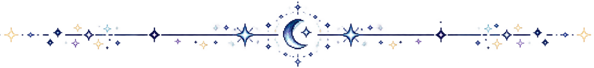

# Hi there, I'm Iza! 👋

### Informatics Student · Mobile Developer · Software Developer

  
  
  
  
  
    
  
  
  

  
  
  

---

## 👋 About Me

I'm an Informatics student who enjoys building mobile and software projects, especially with Kotlin and Jetpack Compose.

Most of my project experience comes from developing mobile applications, while also exploring backend and web development with Node.js, Laravel, and MySQL.

I'm interested in turning ideas into practical applications and continuously improving my skills through projects, collaboration, and experimentation.

---

  

## 🛠️ Tech Stack

### Languages

  
  
  
  

### Frameworks & Technologies

  
  
  
  
  
  

### Tools

  
  
  
  

### Languages I Speak

  
  

---

  

## 🚀 Featured Projects

| Project | Description | Tech Stack |
|---------|-------------|------------|
| **[Learnexus](https://github.com/izaibepe4/Learnexus)** | Online learning mobile application designed around a course-based learning experience | Kotlin, Jetpack Compose, Node.js, MySQL, REST API |
| **[Tumbuh Nyata](https://github.com/adnanfaikar/TumbuhNyata)** | Mobile CSR application for CSR event submissions, verification, workshops, certification, and related activities | Kotlin, Jetpack Compose, Android |
| **SPBE — Diskominfo Kabupaten Malang** | Government information system developed during my internship, focusing on SPBE-related administration and workflows | Laravel 12, Filament 3.3, Alpine.js, Tailwind CSS 4, MySQL |

---

  

## 📊 GitHub Snapshot

---

  

## 👀 Profile Views

---

### Thanks for visiting my profile! 🌙

*If you like my work, consider giving a star to my repositories!*  
*Feel free to fork and contribute to any of my projects!*

 

  

